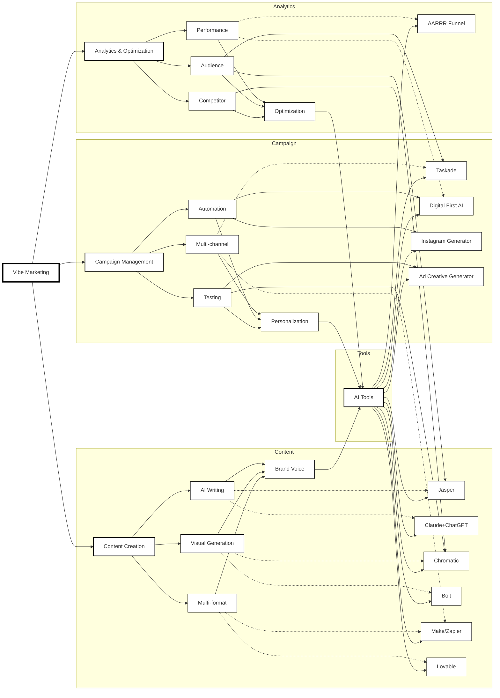

# 🚀 awesome-vibe-anything

```
      ._____.                                   __  .__    .__                
___  _|__\_ |__   ____   _____    ____ ___.__._/  |_|  |__ |__| ____    ____  
\  \/ /  || __ \_/ __ \  \__  \  /    <   |  |\   __\  |  \|  |/    \  / ___\ 
 \   /|  || \_\ \  ___/   / __ \|   |  \___  | |  | |   Y  \  |   |  \/ /_/  >
  \_/ |__||___  /\___  > (____  /___|  / ____| |__| |___|  /__|___|  /\___  / 
              \/     \/       \/     \/\/                \/        \//_____/  
```

[](https://awesome.re)
[](https://www.digitalfirst.ai/blog/vibe-marketing)
[](https://github.com/filipecalegario/awesome-vibe-coding)
[](https://github.com/filipecalegario/awesome-vibe-coding)

> ✨ A curated list of awesome resources for vibe-based development, marketing, and lifestyle tools. ✨

```
  ╭─────────────────────────────────────────────╮
  │  🎯 Vibe Development                         │
  │  🎨 Vibe Marketing                          │
  │  🌟 Vibe Lifestyle                          │
  │  🛠️  Vibe Tools                             │
  ╰─────────────────────────────────────────────╯
```

## 📚 Contents
- [🚀 awesome-vibe-anything](#-awesome-vibe-anything)
  - [📚 Contents](#-contents)
  - [🎯 Vibe Development](#-vibe-development)
    - [🤖 AI Coding Assistants](#-ai-coding-assistants)
    - [🌐 Browser-based Development Tools](#-browser-based-development-tools)
    - [💻 IDEs and Code Editors](#-ides-and-code-editors)
    - [⌨️ Command Line Tools](#️-command-line-tools)
    - [📋 Task Management for AI Coding](#-task-management-for-ai-coding)
    - [📝 Documentation for AI Coding](#-documentation-for-ai-coding)
    - [✨ Vibe Coding Best Practices](#-vibe-coding-best-practices)
    - [🔄 Vibe Coding Workflows](#-vibe-coding-workflows)
    - [📜 Cursor Rules and Templates](#-cursor-rules-and-templates)
  - [🎨 Vibe Marketing](#-vibe-marketing)
    - [🤖 AI Marketing Tools](#-ai-marketing-tools)
    - [📱 Social Media Automation](#-social-media-automation)
    - [✨ Vibe Marketing Best Practices](#-vibe-marketing-best-practices)
    - [🔄 Vibe Marketing Workflows](#-vibe-marketing-workflows)
    - [💰 Vibe Marketing Pricing](#-vibe-marketing-pricing)
    - [🔌 Vibe Marketing Integration](#-vibe-marketing-integration)
    - [🌐 Vibe Marketing Ecosystem \& Workflow](#-vibe-marketing-ecosystem--workflow)
  - [🌟 Vibe Lifestyle](#-vibe-lifestyle)
    - [🍳 Vibe Cooking](#-vibe-cooking)
      - [🤖 AI Recipe Innovation Tools](#-ai-recipe-innovation-tools)
      - [✨ Vibe Cooking Best Practices](#-vibe-cooking-best-practices)
      - [🔄 Vibe Cooking Workflows](#-vibe-cooking-workflows)
    - [💪 Vibe Fitness](#-vibe-fitness)
      - [🤖 AI Fitness Innovation Tools](#-ai-fitness-innovation-tools)
      - [✨ Vibe Fitness Best Practices](#-vibe-fitness-best-practices)
      - [🔄 Vibe Fitness Workflows](#-vibe-fitness-workflows)
      - [🔌 Vibe Fitness Integration](#-vibe-fitness-integration)
    - [✈️ Vibe Travel](#️-vibe-travel)
  - [🛠️ Vibe Tools](#️-vibe-tools)
    - [⚡ Productivity Enhancers](#-productivity-enhancers)
    - [🎨 Creative Tools](#-creative-tools)
    - [👥 Community Resources](#-community-resources)

## 🎯 Vibe Development

### 🤖 AI Coding Assistants
- [System Prompts and Models of AI Tools](https://github.com/x1xhlol/system-prompts-and-models-of-ai-tools) - A comprehensive collection of system prompts and internal tools from various AI coding assistants including Cursor, v0, Manus, Same.dev, Lovable, Devin, and more.
- [Awesome Vibe Coding](https://github.com/filipecalegario/awesome-vibe-coding) - A curated list of vibe coding references and tools for collaborating with AI to write code.

### 🌐 Browser-based Development Tools
- [Bolt.new](https://bolt.new) - Prompt, run, edit, and deploy full-stack web and mobile apps.
- [Lovable](https://www.lovable.com/) - "Idea to app in seconds" - superhuman full stack engineer.
- [v0 by Vercel](https://v0.dev/) - Assistant to build NextJS frontend.
- [Replit](https://replit.com/) - AI-powered development environment for building and deploying applications.
- [Tempo](https://www.tempo.dev/) - Build React apps 10x faster with AI.
- [Softgen](https://softgen.io/) - Build full-stack web apps through natural language instructions.
- [Firebase Studio](https://firebase.google.com/) - Google's agentic cloud-based development environment.

### 💻 IDEs and Code Editors
- [Cursor](https://cursor.sh/) - AI Code Editor, "the best way to code with AI".
- [Windsurf Editor](https://windsurf.io/) - Agentic IDE where developers and AI work together seamlessly.
- [Zed](https://zed.dev/) - High-performance code editor for AI collaboration.

### ⌨️ Command Line Tools
- [Claude Code](https://github.com/anthropics/claude-code) - Coding agent that understands your codebase and automates tasks.
- [Aider](https://github.com/paul-gauthier/aider) - AI pair programming in your terminal.
- [MyCoder.ai](https://mycoder.ai/) - Open source AI-powered coding assistant with Git integration.
- [CodeSelect](https://github.com/codeselect) - Python-based CLI tool for AI code communication.

### 📋 Task Management for AI Coding
- [Boomerang Tasks](https://boomerangtasks.com/) - Automatically break down complex projects into manageable pieces.
- [Claude Task Master](https://github.com/claude-task-master) - AI-powered task-management system for various IDEs.

### 📝 Documentation for AI Coding
- [CodeGuide](https://codeguide.ai/) - Creates detailed documentation for AI coding projects.

### ✨ Vibe Coding Best Practices
- **Natural Language First**: Describe what you want to build in plain language
- **Iterative Development**: Use AI to quickly prototype and refine
- **Code Understanding**: Let AI explain and document your code
- **Task Automation**: Delegate repetitive tasks to AI
- **Collaborative Workflow**: Combine human creativity with AI efficiency

### 🔄 Vibe Coding Workflows

1. **Project Setup**
   - Describe project requirements
   - Let AI generate initial structure
   - Review and refine architecture

2. **Development Process**
   - Natural language coding
   - AI-assisted debugging
   - Automated testing

3. **Documentation & Maintenance**
   - AI-generated documentation
   - Code explanation
   - Performance optimization

### 📜 Cursor Rules and Templates
- [Awesome CursorRules](https://github.com/PatrickJS/awesome-cursorrules) - A curated collection of `.cursorrules` files for enhancing your Cursor AI experience, including templates for various frameworks, languages, and development scenarios.

## 🎨 Vibe Marketing

Vibe marketing represents a modern approach to marketing that leverages AI tools to automate and enhance marketing efforts. As described in [Digital First AI's comprehensive guide](https://www.digitalfirst.ai/blog/vibe-marketing), it enables a single marketer with AI tools to accomplish what traditionally required 10+ specialists, allowing for:
- 🎯 Testing hundreds of ad variations against competitors
- ⚡ Deploying multi-channel campaigns in just 24 hours
- 📊 Analyzing conversion data without needing data team support
- ✨ And more

### 🤖 AI Marketing Tools
- [Digital First AI](https://digitalfirst.ai/) - AI-powered marketing workflow automation platform that helps create and execute marketing campaigns in minutes instead of weeks.
- [Jasper](https://www.jasper.ai/) - AI content generation platform for creating marketing copy and content.
- [Chromatic](https://www.chromatic.com/) - AI-powered creative testing and optimization platform.
- [Make/Zapier](https://www.make.com/) - No-code automation tools for connecting marketing workflows.
- [Bolt](https://www.bolt.com/) - Browser-based development environment for building marketing assets without complex local setups.
- [Lovable](https://www.lovable.com/) - Full-stack application builder with text-to-code translation and Supabase integration.
- [Taskade](https://www.taskade.com/) - AI workflow automation platform with team collaboration features.

### 📱 Social Media Automation
- [Instagram Content Campaign Generator](https://www.digitalfirst.ai/) - AI workflow that generates 15 days of social media content in minutes.
- [AARRR Pirate Funnel](https://www.digitalfirst.ai/) - AI-powered conversion funnel analysis and optimization tool.
- [Ad Creative Generator](https://www.digitalfirst.ai/) - AI tool for creating and testing multiple ad variations quickly.
- [Claude + ChatGPT Combo](https://www.anthropic.com/) - Advanced prompt engineering and creative generation workflow.

### ✨ Vibe Marketing Best Practices
- **Speed & Efficiency**: Launch campaigns in hours instead of weeks
- **Data-Driven Creativity**: Use AI to analyze and optimize content performance
- **Personalization at Scale**: Create targeted content for different audience segments
- **Multi-Channel Testing**: Test variations across different platforms simultaneously
- **Real-Time Optimization**: Adjust campaigns based on immediate feedback

### 🔄 Vibe Marketing Workflows
1. **Content Creation**
   - AI-powered content generation
   - Multi-format content adaptation
   - Brand voice consistency

2. **Campaign Management**
   - Automated campaign deployment
   - Performance tracking
   - A/B testing automation

3. **Audience Engagement**
   - Personalized messaging
   - Social media automation
   - Community management

### 💰 Vibe Marketing Pricing
- **Taskade Plans**:
  - Free: Basic access with limited AI features
  - Pro: $10/month with enhanced AI capabilities
  - Team: $50/month for unlimited workflows and full collaboration

### 🔌 Vibe Marketing Integration
- **Taskade Integrations**:
  - Gmail
  - Slack
  - Google Calendar
  - And more...

### 🌐 Vibe Marketing Ecosystem & Workflow



## 🌟 Vibe Lifestyle

### 🍳 Vibe Cooking
- [ChefGPT](https://www.chefgpt.com/) - AI-powered recipe generator that creates innovative recipes based on available ingredients and dietary preferences.
- [Plant Jammer](https://plantjammer.com/) - AI cooking assistant that helps create plant-based recipes from ingredients you have.
- [SideChef](https://www.sidechef.com/) - Interactive cooking assistant with step-by-step voice guidance and ingredient substitutions.
- [Moley Robotics](https://moley.com/) - World's first robotic kitchen that can cook thousands of recipes with precision.
- [Notion AI Recipe Organizer](https://www.notion.so/) - AI-powered recipe management system that helps organize and adapt recipes.

#### 🤖 AI Recipe Innovation Tools
1. **Ingredient Substitution**
   - Smart ingredient alternatives
   - Dietary restriction adaptations
   - Flavor profile matching

2. **Recipe Generation**
   - AI-created fusion recipes
   - Seasonal ingredient suggestions
   - Cultural cuisine combinations

3. **Cooking Assistance**
   - Voice-guided instructions
   - Real-time cooking tips
   - Temperature and timing optimization

4. **Meal Planning**
   - AI-powered meal suggestions
   - Nutritional balance analysis
   - Shopping list generation

#### ✨ Vibe Cooking Best Practices
- **Ingredient Optimization**: Use AI to suggest creative uses for available ingredients
- **Flavor Exploration**: Discover new flavor combinations through AI recommendations
- **Dietary Adaptation**: Easily modify recipes for different dietary needs
- **Cultural Fusion**: Combine elements from different cuisines for unique dishes
- **Seasonal Cooking**: Get AI suggestions based on seasonal availability

#### 🔄 Vibe Cooking Workflows
1. **Recipe Discovery**
   - Input available ingredients
   - Specify dietary preferences
   - Get AI-generated recipe suggestions

2. **Cooking Process**
   - Follow AI-guided instructions
   - Get real-time cooking tips
   - Adjust based on preferences

3. **Recipe Management**
   - Save successful recipes
   - Track modifications
   - Share with community

### 💪 Vibe Fitness
- [Future](https://www.future.co/) - AI-powered personal training with real-time form correction and personalized workout plans.
- [Freeletics](https://www.freeletics.com/) - AI fitness coach that adapts workouts based on your performance and goals.
- [Tempo](https://www.tempo.fit/) - Smart home gym with AI-powered form analysis and real-time feedback.
- [Zing Coach](https://www.zingcoach.com/) - AI personal trainer that creates custom workout plans and tracks progress.
- [FitnessAI](https://www.fitnessai.com/) - AI-powered workout optimization and progress tracking.

#### 🤖 AI Fitness Innovation Tools
1. **Workout Generation**
   - Personalized training plans
   - Adaptive difficulty levels
   - Goal-specific programming
   - Recovery optimization

2. **Form Analysis**
   - Real-time movement tracking
   - Posture correction
   - Injury prevention
   - Performance optimization

3. **Progress Tracking**
   - AI-powered analytics
   - Performance predictions
   - Goal achievement tracking
   - Progress visualization

4. **Nutrition Integration**
   - Meal planning
   - Macro tracking
   - Supplement recommendations
   - Hydration monitoring

#### ✨ Vibe Fitness Best Practices
- **Personalized Training**: Use AI to create custom workout plans
- **Form Optimization**: Get real-time feedback on exercise technique
- **Progress Monitoring**: Track improvements with AI analytics
- **Recovery Management**: Optimize rest and recovery periods
- **Goal Adaptation**: Adjust training based on changing objectives

#### 🔄 Vibe Fitness Workflows
1. **Initial Assessment**
   - Fitness level evaluation
   - Goal setting
   - Health history review
   - Equipment availability check

2. **Training Process**
   - AI-guided workouts
   - Real-time form feedback
   - Progress tracking
   - Plan adjustments

3. **Recovery & Nutrition**
   - Recovery monitoring
   - Nutrition planning
   - Sleep tracking
   - Stress management

#### 🔌 Vibe Fitness Integration
- **Smart Devices**:
  - Wearable fitness trackers
  - Smart scales
  - Heart rate monitors
  - Sleep trackers

- **Health Apps**:
  - Nutrition tracking
  - Meditation apps
  - Sleep analysis
  - Stress management

### ✈️ Vibe Travel
- Coming soon...

## 🛠️ Vibe Tools

### ⚡ Productivity Enhancers
- Coming soon...

### 🎨 Creative Tools
- Coming soon...

### 👥 Community Resources
- Coming soon...